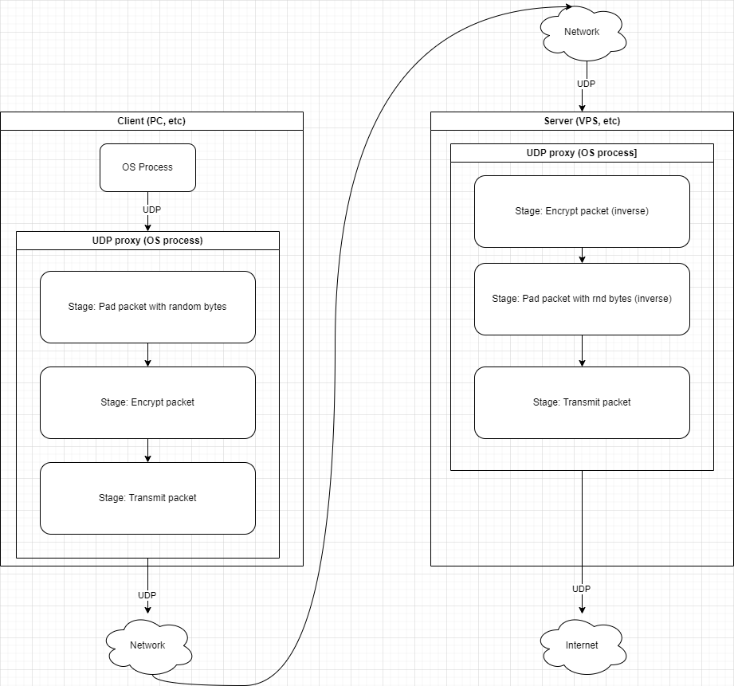

# udpproxy

`udpproxy` is a simple obfuscating UDP proxy, i.e., it receives UDP
packet, makes it look like random noise and sends it somewhere else.

Here is sample configuration/pipeline:



In this picture,

- Some client process sends regular UDP payload to proxy;
- Proxy
  - Pads packet with some random bytes;
  - Encrypts packet;
  - Sends packet to some destination/upstream;

UDP packet leaving client PC is completely obfuscated. It looks like
random noise (due to encryption) and has random length(due to padding).

Destination (which in this picture is *Server(VPS)*):

- Receives UDP packet from client proxy;
- Performs inverse of encryption, i.e., decryption;
- Removes padding bytes;
- Sends packet to some destination/upstream;

Packet leaving server side looks exactly as it were received by proxy on
client side.

Response packet(received by server) flows in reverse direction: add padding bytes,
encrypt, send to client. Client will also do reverse: decrypt,
unpad. Original client application will get packet in expected format.

`udpproxy` is a reverse proxy, meaning, client application knows
nothing about proxy and can't tell proxy where to actually send
packet. Client just sends packet to proxy, proxy sends it somewhere
else, receives response and sends response back to client.

Moreover, receiving side may or may not know about source of UDP
packet. If you configure to send out packet as it is, without any
padding or encryption, then receiving side can process packet. If you
configure padding and/or encryption, then receiving side will get
packet in invalid format. To solve that, just put another proxy on
receiving side and configure that proxy to do inverse pipeline.

> This utility does **NOT protect** your network traffic from [Forward secrecy](https://en.wikipedia.org/wiki/Forward_secrecy)
>  attack. If your encryption keys leak and some attacker has all your
>  previous traffic captured then attacker will decrypt your past
>  network traffic.
>
>  This is by design. To solve that, you may run some more secure
>  network protocol though proxy. ([Wireguard](https://en.wikipedia.org/wiki/WireGuard) as an example).


## Usage

```
USAGE: udpproxy [--help] [<subcommand> [<options>]]

SUBCOMMANDS:

    run <options>         Run proxy.
    readprint <options>   Read config file, enrich it with default values and print to stdout.

    Use 'udpproxy <subcommand> --help' for additional information.

OPTIONS:

    --help                display this list of options.
```

Write config file and `udpproxy run -c <path-to-config.json>`.


## Documentation

You can read more docs at [docs](docs) directory.

- [Building](docs/building.md)
- [Configuration](docs/configuration.md)
- [Pipeline reference](docs/pipelinesref.md)
